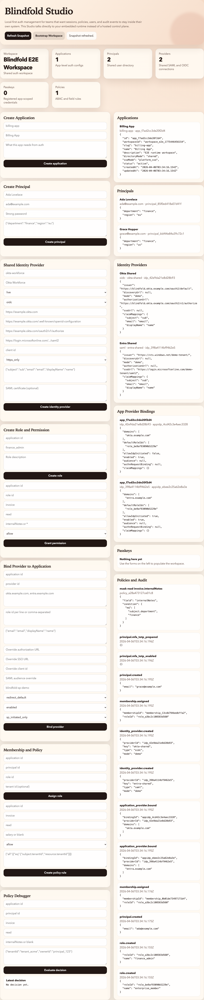

# Blindfold Auth

Blindfold Auth is a local-first authentication and authorization workspace for JavaScript and TypeScript teams that do not want a hosted control plane.

Start here:

- `docs/MASTER_GUIDE.md` for the canonical guide
- `ROADMAP.md` for the phased delivery plan
- `CONTRIBUTING.md` for contributor workflow and local setup
- `SECURITY.md` for vulnerability reporting
- `docs/ARCHITECTURE.md` for the system overview
- `docs/GO_LIVE.md` for the deploy and release runbook
- `docs/SECURITY_AUDIT.md` for the current hardening status
- `docs/PERFORMANCE.md` for the current benchmark baseline
- `docs/LAUNCH_ASSETS.md` for the screenshot and GIF capture guide
- `docs/RELEASE_NOTES_RC1.md` for the first launch-ready release copy
- `docs/contracts/CONFIG_CONTRACT.md` for the standardized env and config shape

The current implementation in this repository ships:

- `@blindfold/auth`: embedded auth runtime with sessions, RBAC/ABAC, audit logging, rate limiting, and admin APIs
- `@blindfold/auth-cli`: CLI for bootstrapping a workspace and launching Studio locally
- `@blindfold/auth-studio`: local web Studio for configuration, users, policies, and debugging
- `@blindfold/auth-storage-postgres`: PostgreSQL document-table adapter and schema SQL
- `@blindfold/auth-adapter-serverless`: API Gateway and Lambda integration helpers
- `examples/local-workspace`: local embedded demo workspace
- `examples/postgres-workspace`: recommended Node + Postgres deployment example
- `examples/lambda-dynamodb`: reference Lambda layout for a DynamoDB-backed deployment

## Why this shape

Blindfold Auth is built for teams that want:

- their users, sessions, policies, and audit logs in their own infrastructure
- a package-first model instead of a hosted auth vendor
- a shared auth workspace across multiple applications
- table-driven RBAC and ABAC policies with field-level effects
- passkey-first login with local data ownership
- shared enterprise identity providers with per-application bindings
- local tooling that makes enterprise auth understandable instead of hidden behind a remote dashboard

## Quick start

```sh
npm install
npm run seed:launch-demo
npm run studio:example
```

Then open [http://localhost:4110](http://localhost:4110).

## Launch demo and assets

Generate the local launch screenshots and GIFs from the same Playwright-backed harness used in CI:

```sh
npm run playwright:install
npm run launch:assets
```

Artifacts land in `docs/assets/launch/`:

- `studio-overview.png`
- `passkey-login.png`
- `provider-bindings.png`
- `policy-debugger.png`
- `bootstrap-to-studio.gif`
- `magic-link-to-passkey.gif`
- `domain-routing-sso.gif`

See `docs/LAUNCH_ASSETS.md` for the shot list, README placements, and capture notes.




## Node + Postgres example

The recommended deployment lane now has a runnable reference example:

```sh
cp ./examples/postgres-workspace/.env.example ./examples/postgres-workspace/.env
set -a && source ./examples/postgres-workspace/.env && set +a
npm run postgres:up
npm run migrate:postgres-example
npm run bootstrap:postgres-example
npm run smoke:postgres-example
npm run studio:postgres-example
```

## Open-source readiness

The repo now includes the baseline community and release files needed for a public launch:

- `LICENSE`
- `CODE_OF_CONDUCT.md`
- `CONTRIBUTING.md`
- `SECURITY.md`
- `SUPPORT.md`
- `CHANGELOG.md`
- `.github/ISSUE_TEMPLATE/*`
- `.github/PULL_REQUEST_TEMPLATE.md`
- `.github/FUNDING.yml`
- `.github/dependabot.yml`
- `.github/workflows/*`

See `docs/MASTER_GUIDE.md` for the full deployment and release checklist.

## Packages

### `@blindfold/auth`

```js
import { createAuth, createMemoryStorage } from "@blindfold/auth";

const auth = createAuth({
  workspaceId: "workspace_demo",
  secret: "replace-me",
  storage: createMemoryStorage(),
});
```

The runtime centers on:

- `createAuth()`
- `auth.protect()`
- `auth.can()`
- `auth.session.*`
- `auth.admin.*`

### `@blindfold/auth-cli`

```sh
# Build the workspace first (TypeScript → dist/), then run the CLI:
npm run build:ts
npm run studio:example
# …or invoke the compiled CLI directly:
node packages/auth-cli/dist/bin/blindfold-auth.js studio --config ./examples/local-workspace/dist/blindfold.config.js
```

### `@blindfold/auth-studio`

Studio is a local web app started by the CLI. It talks to the embedded runtime through validated admin APIs and includes a basic policy debugger.

### `@blindfold/auth-storage-postgres`

The Postgres adapter uses one table per auth domain and stores a document payload in `jsonb`. That keeps the control plane table-driven while leaving room for future indexing and normalization.

### `@blindfold/auth-adapter-serverless`

The serverless adapter wraps the embedded runtime for API Gateway style events and responses.

## Current scope

Implemented now:

- shared local auth workspace
- multi-application config
- password auth
- magic link issuance and redemption
- passkey registration and authentication with WebAuthn
- TOTP and recovery-code MFA
- shared identity providers and per-application OIDC/SAML bindings
- domain-routed enterprise sign-in with deterministic JIT linking
- live OIDC authorization-code verification and live SAML signed-response validation
- SAML metadata generation and local demo callback flows for enterprise demos
- sessions and refresh rotation
- RBAC and ABAC evaluation
- field-level `allow`, `deny`, `mask`, and `readonly`
- rate limiting and brute-force protection
- audit events
- CLI and local Studio
- serverless adapter
- Postgres schema and adapter primitives
- runnable Node + Postgres example with Docker-backed local database and smoke check
- Playwright E2E coverage for Studio and runtime flows
- baseline security hardening for magic links, session revocation, and cross-app session isolation
- repeatable local performance benchmark and Postgres hot-path indexes
- baseline open-source governance, templates, funding config, and GitHub automation

Next hardening work:

- provider-specific external federation interoperability hardening
- SCIM and richer lifecycle provisioning
- compliance export flows
- deeper external security review and larger Postgres/runtime performance profiling

## Test coverage

Unit tests:

```sh
npm test
```

Playwright E2E:

```sh
npm run playwright:install
npm run test:e2e
```

Run everything:

```sh
npm run test:all
```

Performance baseline:

```sh
npm run perf:bench -- --assert
```

Serverless reference smoke:

```sh
npm run smoke:lambda-example
```

## Repo layout

```txt
.github/
  ISSUE_TEMPLATE/
  workflows/
docs/
examples/
packages/
```
