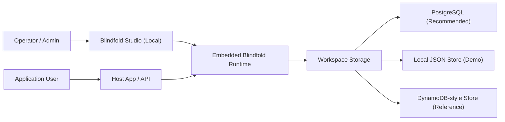
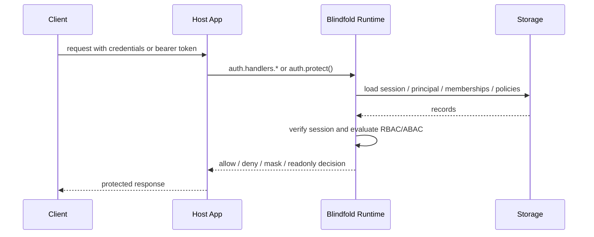

# Blindfold Auth Architecture

Blindfold Auth is a package-first, local-first auth workspace. The default deployment model is not a hosted control plane. Teams embed the runtime in their own application, point it at their own storage, and run Studio locally when they need to manage config, users, policies, and debugging.

## Core principles

- auth state stays in customer-owned infrastructure
- the runtime is embedded, not remotely brokered
- configuration is table-driven, not hidden in vendor dashboards
- one workspace can serve multiple applications
- the recommended production lane is `Node + Postgres`

## Package layout

- `@blindfold/auth`
  The embedded runtime, admin APIs, session logic, RBAC/ABAC policy evaluation, and route protection helpers.
- `@blindfold/auth-cli`
  Bootstrap, migration, demo seeding, and local Studio startup commands.
- `@blindfold/auth-studio`
  The local operator UI served by the CLI or embedded runtime.
- `@blindfold/auth-storage-postgres`
  The primary production storage adapter and migration contract.
- `@blindfold/auth-adapter-serverless`
  API Gateway/Lambda request normalization and handler wrapping.

## High-level architecture

## Runtime request flow

## Workspace model

The shared workspace is the top-level control plane inside the customer's own system.

- `workspace`
  Stores defaults and global audit context.
- `application`
  Each app has its own auth config, roles, policies, memberships, and runtime behavior.
- `principal`
  Shared directory identity unless an app later opts into a more isolated model.
- `membership`
  Connects principals to applications, optional tenants, and roles.
- `policy`
  Table-driven ABAC rules layered on top of RBAC permissions.
- `session`
  Access and refresh state scoped to an application and principal.

## Data and trust boundaries

### Trusted components

- embedded runtime code
- customer-owned database/storage
- local Studio started by the team

### Untrusted inputs

- incoming HTTP bodies and headers
- policy form input until validated
- route resource attributes
- adapter-normalized event payloads

## Deployment lanes

### Lane A: Embedded Node + Postgres

This is the recommended production lane.

- app embeds `@blindfold/auth`
- Postgres stores workspace tables
- Studio runs locally against the same workspace
- migrations are applied through the CLI/config contract

### Lane B: Local file-backed workspace

This is the easiest learning and demo lane.

- app embeds `@blindfold/auth`
- file storage persists to local JSON
- best for onboarding and early prototyping

### Lane C: Lambda + DynamoDB reference

This is the reference serverless lane.

- API Gateway style events are normalized by the serverless adapter
- a DynamoDB-like document store backs the runtime
- useful for reference deployments, not the main architecture driver

## Authorization model

Blindfold Auth uses:

- default deny
- explicit allow for baseline access
- explicit deny for high-priority exceptions
- field-level `mask` and `readonly` outcomes

Evaluation order:

1. hard security deny
2. explicit deny
3. mask / readonly
4. explicit allow
5. default deny

## Why the architecture is shaped this way

This design optimizes for:

- lower vendor lock-in
- easier self-hosting
- multi-application auth consistency
- enterprise-style policy control without hosted dependencies
- a safer path to open source adoption, because teams can inspect and run everything locally
